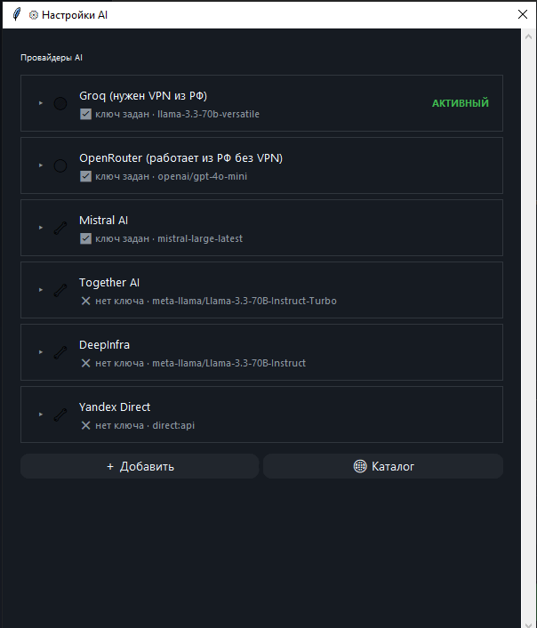

# 🎙️ XTTS Studio
> Портативное офлайн-приложение для клонирования голоса и синтеза речи на базе XTTS v2

---

## 🚀 О проекте

XTTS Studio — полностью офлайн инструмент для синтеза речи и клонирования голоса.  
Работает в портативном режиме, не требует установки и не использует интернет.  
AI-модуль опционален — подключается через любой OpenAI-совместимый провайдер.

---

> ⚠️ Google Drive может показать предупреждение о большом размере файла перед скачиванием — это нормально, файл не проверяется антивирусом Google из-за размера, а не из-за угрозы.

- ⚙️ CPU-only версия 5 ГБ 👉 [📥 Download XTTS Studio (Google Drive)](https://drive.google.com/file/d/1RJfaMjVHV_NUaaHgg4uSd0B8DI9noxRs/view?usp=drive_link)
- ⚙️ С поддержкой видеокарты N-Vidia CUDA 10 ГБ 👉 [📥 Download XTTS Studio (CUDA)](https://github.com/DreamSketcher/XTTS-Studio-portable-/releases)

---

📜 Лицензия: [LICENSE.md](./LICENSE.md) — свободное использование с обязательным указанием автора

---

## 🧩 Разработка

Использовались AI-инструменты: Claude, ChatGPT

---

## ⚖️ Сторонние компоненты

Проект использует модель **XTTS v2** (Coqui), распространяемую под лицензией [Coqui Public Model License (CPML)](https://coqui.ai/cpml). Использование модели регулируется условиями CPML независимо от лицензии данного проекта.

---

## ✨ Возможности

### 🎤 Синтез и клонирование
- Полностью офлайн — никаких внешних запросов
- Portable — одна папка, любой Windows ПК
- Клонирование голоса по референсу 10–20 секунд
- Библиотека голосов с кэшем Speaker Embedding
- Поддержка длинных текстов без ограничений
- Авто-переключение языка RU/EN внутри одного текста

### 🧠 Обработка текста
- Числа → слова автоматически
- Аббревиатуры → фонетический словарь (авто + ручной)
- Смысловые и пунктуационные паузы — автоматически
- Нормализация текста перед генерацией

### 🎛 Управление качеством
- 4 пресета: ⭐ Высокое качество / 📖 Нарратив / ⚡ Динамика / 🎭 Экспрессия
- Тонкая настройка: temperature, top_p, repetition_penalty, скорость, trim
- Контроль качества чанков — авто-перегенерация при повторах и обрывах
- Де-эссер, RMS-нормализация громкости, авто-обрезка тишины
- Кэш чанков — повторная генерация того же текста не тратит время

### 🤖 AI-модуль (опционально)
- **AI Conductor** — анализирует текст и назначает параметры XTTS для каждого чанка индивидуально
  - Уровень 1: temperature, speed, паузы по контексту и интонации
  - Уровень 2: rewrite текста под заданный жанр или настроение (с negative prompt)
  - Оба уровня работают независимо и комбинируются
- **AI чат** — встроенный чат-ассистент с историей сессий и поиском
  - Режим редактора текста и режим свободного чата
  - Кнопка "Улучшить" — технический rewrite текста для лучшего TTS
- Поддержка цепочки провайдеров: Groq, OpenRouter, кастомные OpenAI-совместимые
- Каталог провайдеров, библиотека ключей

### 📋 Прочее
- Очередь задач с отменой
- Пакетная обработка TXT-файлов
- История генераций с возвратом текста
- Подсветка текущего чанка в реальном времени
- Статистика: время, чанки, голос, скорость
- Автосохранение настроек между сессиями
- Экспорт в WAV и MP3


## 🖼 Скриншоты

<p align="center">
  
  
</p>
<p align="center">
  
  
</p>

## 🚀 Быстрый старт

1. Скачайте и распакуйте архив
2. Не используйте путь с кириллицей
3. Запустите `XTTS Studio.exe`
4. Выберите или загрузите голосовой референс
5. Введите текст
6. Нажмите Generate
7. Результат сохраняется в `outputs/`кнопка Аудио

---

## ⚙️ Как работает

1. Загрузка голосового референса → авто-обработка и нормализация
2. (Опционально) сохранение в библиотеку голосов
3. Ввод текста → нормализация, числа в слова, аббревиатуры
4. (Опционально) AI-улучшение или rewrite текста
5. Разбивка на чанки → простановка пауз
6. (Опционально) AI Conductor — параметры для каждого чанка
7. Генерация с контролем качества и кэшированием
8. Сборка, нормализация громкости, де-эссер → финальный файл

---

## 📁 Структура проекта

```
engine/          — ядро: TTS пайплайн, AI модуль, обработка текста
gui.py           — графический интерфейс
settings.json    — настройки пользователя
gpt_settings.json — настройки AI провайдеров и ключей
word_rules.json  — словарь произношений
ffmpeg/          — встроенный FFmpeg
library/         — библиотека голосов
reference/       — входные аудио референсы
outputs/         — результаты генерации
logs/            — логи работы
models/          — модель XTTS v2 (офлайн)
python/          — portable Python runtime
XTTS Studio.exe  — точка входа
```

---

## 🧠 Словарь произношений

Примеры встроенных правил:
```
AI      → эй ай
CPU     → си-пи-ю
GPU     → джи-пи-ю
OpenAI  → ОпенЭйАй
```

Словарь пополняется автоматически при генерации и через AI Conductor.

---

## 💻 Требования

- Windows 10/11 x64
- CPU версия: 8+ ГБ RAM, генерация медленнее в реальном времени
- CUDA версия: NVIDIA GPU с 4+ ГБ VRAM, CUDA Compute Capability 6.0+

---

## ⚠️ Важно

Не используйте пути с кириллицей:
```
✔ C:\XTTS\
✘ C:\Новая папка\XTTS\
```

---

## ☕ Поддержка проекта

BTC: `bc1qz78u3lvagt3v886359glv57ct6rnlh506wjmdy`

```
 Полная Структура XTTS Studio (portable + optional AI)

├── gui.py                              ← главное окно, весь UI
│   ├── word_replacer_enabled           ← BooleanVar, флаг словаря
│   ├── lang_split_enabled              ← BooleanVar, авто-переключение языка
│   ├── use_gpt                         ← BooleanVar, флаг AI-улучшения текста (технический редактор)
│   ├── on_task_update()                ← UI callback от task_manager
│   ├── _highlight_chunk()              ← подсветка чанка по координатам
│   ├── _highlight_chunk_by_text()      ← подсветка чанка по тексту (fallback)
│   ├── generate()                      ← сборка Task и отправка в очередь
│   ├── open_word_replacer()            ← окно словаря произношений
│   ├── pick_language()                 ← окно выбора языка + переключатель lang_split
│   ├── open_quality_settings()         ← окно тонкой настройки пресета
│   ├── open_styles_menu()              ← popup меню стилей (открывается вверх)
│   ├── open_outputs_folder()           ← окно управления аудио-файлами + плеер
│   ├── open_history()                  ← история генераций с возвратом текста
│   ├── open_batch_window()             ← пакетная обработка TXT-файлов
│   ├── open_ai_conductor_window()      ← окно настройки AI Conductor (2 уровня)
│   │                                      предупреждение при первом запуске (флаг в settings.json)
│   ├── toggle_chat_panel()             ← открытие AI чат-окна
│   ├── save_settings()                 ← сохранение сессии в settings.json
│   └── apply_settings()               ← восстановление сессии
│
├── settings.json                       ← настройки сессии (авто)
├── gpt_settings.json                   ← провайдер AI, ключи, модели (авто)
├── word_rules.json                     ← словарь произношений (авто + ai_corrected)
├── chat_history.json                   ← история AI чат-сессий
├── history.json                        ← история генераций
│
├── engine/
│   ├── tts_runner.py                   ← главный пайплайн
│   │   ├── run_tts()                   ← normalize→WR→chunk→conductor→generate→merge
│   │   │                                  rewrite текста если ai_rewrite_enabled (до чанкинга)
│   │   ├── get_tts()                   ← ленивая загрузка модели (thread-safe, singleton)
│   │   ├── _detect_device()            ← автодетект CUDA/CPU
│   │   ├── _split_by_language()        ← разбивка чанка на ru/en подчанки
│   │   ├── _get_embedding()            ← кэш speaker embedding (по устройству)
│   │   ├── _chunk_cache_key/get/set()  ← кэш готовых чанков (md5)
│   │   ├── _detect_repeats()           ← QC: детектор зацикливания
│   │   ├── _validate_duration()        ← QC: валидатор длительности/тишины
│   │   ├── _is_dense_abbrev_chunk()    ← детектор плотных серий аббревиатур
│   │   ├── _adjust_params_for_chunk()  ← temperature schedule (без кондуктора)
│   │   ├── _adaptive_trim()            ← авто-обрезка хвоста по тишине
│   │   ├── _normalize_loudness()       ← выравнивание громкости (RMS, pydub)
│   │   ├── _normalize_numpy_audio()    ← выравнивание громкости (fallback)
│   │   ├── _make_output_name()         ← имя выходного файла, защита от дублей
│   │   ├── _build_chunk_text_map()     ← карта чанков для подсветки GUI
│   │   └── _normalize_lookup_text_with_map() ← нормализация текста для поиска
│   │
│   ├── ai_conductor.py                 ← AI Conductor (2 уровня обработки)
│   │   ├── conduct()                   ← основной вызов: анализ текста + параметры чанков
│   │   │                                  Уровень 1: temperature/speed/паузы для каждого чанка
│   │   │                                  Уровень 2: rewrite текста под стиль (rewrite_enabled)
│   │   │                                  + negative prompt (rewrite_negative)
│   │   │                                  + проверка транслита (corrections → word_rules.json)
│   │   │                                  возвращает dict{rewritten_text, chunks} или list[dict]
│   │   ├── _validate_map()             ← валидация и зажим параметров + пробрасывание corrections
│   │   └── _fallback_params()          ← дефолтные параметры если AI недоступен
│   │
│   ├── chat_window.py                  ← AI чат-окно
│   │   ├── open_chat_window()          ← главное окно чата с сессиями
│   │   │                                  режим переключения: редактор текста / свободный чат
│   │   ├── send_chat_message()         ← отправка + генерация ответа
│   │   ├── _run_generation()           ← воркер генерации, системный промпт по режиму
│   │   ├── improve_text_with_gpt()     ← кнопка "Улучшить" — технический rewrite для TTS
│   │   ├── open_gpt_settings()         ← настройки провайдера, ключей, моделей
│   │   │                                  каталог провайдеров, библиотека ключей
│   │   │                                  кастомные провайдеры (добавить/редактировать/удалить)
│   │   └── _load_sessions/_save_sessions() ← персистентность истории
│   │
│   ├── gpt_client.py                   ← AI клиент
│   │   ├── _call_with_chain()          ← перебор провайдеров (активный первый)
│   │   ├── _build_provider_chain()     ← цепочка: активный → встроенные → кастомные
│   │   ├── _call_api()                 ← низкоуровневый HTTP-запрос
│   │   ├── chat()                      ← чат с опциональным system prompt
│   │   ├── improve_for_tts()           ← технический rewrite текста под TTS
│   │   ├── preprocess_for_tts()        ← обёртка с поддержкой режимов
│   │   ├── validate_key()              ← проверка API-ключа
│   │   ├── get/set_provider()          ← активный провайдер
│   │   ├── get/set_model()             ← модель активного провайдера
│   │   ├── get/set_api_key()           ← ключ активного провайдера
│   │   ├── list_keys/add_key/...       ← библиотека именованных ключей
│   │   ├── add/update/delete_custom_provider() ← управление кастомными провайдерами
│   │   │                                  удаление чистит ключ и модель из settings
│   │   ├── hide/show_provider()        ← скрытие встроенных провайдеров
│   │   │                                  скрытие чистит ключ и модель из settings
│   │   ├── fetch_models_from_url()     ← загрузка списка моделей с эндпоинта
│   │   └── PROVIDER_CATALOGUE          ← встроенный каталог известных провайдеров
│   │
│   ├── normalizer.py                   ← нормализация текста
│   │   ├── normalize()                 ← числа→слова, аббревиатуры, пунктуация
│   │   ├── safe_character_filter()     ← фильтр символов (после word_replacer)
│   │   ├── _fix_abbrev_rhythm()        ← ритм серий латинских аббревиатур
│   │   ├── _fix_mixed_case_rhythm()    ← ритм CamelCase/брендов
│   │   └── _fix_cyrillic_abbrev()      ← кириллические аббревиатуры
│   │
│   ├── chunker.py                      ← разбивка на чанки
│   │   ├── chunk_text()                ← главный метод
│   │   ├── _split_sentences()          ← разбивка на предложения
│   │   ├── _split_long()               ← нарезка длинных предложений
│   │   ├── _merge()                    ← объединение коротких чанков
│   │   ├── _is_bad_start()             ← проверка плохого начала чанка
│   │   └── _is_bad_end()               ← проверка плохого конца чанка
│   │
│   ├── word_replacer.py                ← фонетические замены
│   │   ├── apply()                     ← к каждому чанку перед генерацией
│   │   ├── add_rule()                  ← добавление правила (+ ai_corrected от кондуктора)
│   │   ├── remove_rule()               ← удаление правила
│   │   ├── _looks_like_abbrev()        ← детектор капс-аббревиатур (CPU, GPU)
│   │   ├── _auto_transliterate_abbrev() ← побуквенная транслитерация аббревиатур
│   │   ├── _looks_like_lowercase_term() ← детектор технических терминов (pydub)
│   │   └── _transliterate_term_word()  ← слоговая транслитерация терминов
│   │
│   ├── text_utils.py                   ← общие текстовые хелперы
│   │   └── is_list_item()              ← детектор пунктов списка
│   │
│   ├── smart_pauses.py                 ← паузы между чанками (без кондуктора)
│   │   └── get_pause_ms()              ← длительность паузы по паре чанков
│   │
│   ├── prosody_layer.py                ← смысловые паузы (без кондуктора)
│   │   ├── create_prosody_layer()      ← фабрика по preset
│   │   └── process_chunks()            ← обработка с учётом серий list-item
│   │
│   ├── reference_processor.py          ← конвертация и нормализация референса
│   │   └── process_reference()         ← конвертация в WAV, SNR-проверка, кэш
│   │
│   ├── voice_manager.py                ← библиотека голосов
│   │   ├── scan_voices()               ← сканирование library/ на диске
│   │   ├── list_voices()               ← список доступных голосов
│   │   ├── get_voice()                 ← профиль по имени
│   │   └── set_active()                ← установка активного голоса
│   │
│   ├── de_esser.py                     ← подавление шипящих
│   │   ├── create_de_esser()           ← фабрика по intensity/sample_rate
│   │   └── process_segment()           ← обработка финального аудио
│   │
│   ├── task_manager.py                 ← многопоточная очередь
│   │   ├── start()                     ← запуск worker-потока
│   │   ├── add_task()                  ← постановка задачи
│   │   └── cancel_task()               ← отмена по id
│   │
│   ├── task_models.py                  ← модель задачи Task
│   ├── task_queue.py                   ← thread-safe очередь
│   └── updater.py                      ← авто-обновление (check/apply/restart)
│
├── models/xtts_v2/                     ← модель (офлайн)
├── library/                            ← голосовые профили
│   └── [voice_name]/
│       ├── normalized.wav
│       └── normalized_*_embedding.pth  ← кэш embedding (CPU/CUDA)
├── outputs/                            ← готовые аудио файлы
│   └── _cache/                         ← кэш чанков (md5)
├── logs/                               ← логи ошибок
├── reference/                          ← исходные референс файлы
├── ffmpeg/bin/                         ← ffmpeg.exe, ffprobe.exe
├── python/
│   ├── xtts_env/                       ← venv с зависимостями
│   └── runtime/                        ← Python 3.11 portable
└── XTTS Studio.exe                     ← точка входа


[✓] Офлайн             — никаких внешних запросов (кроме опционального AI-модуля)
[✓] Portable           — одна папка, любой Windows ПК
[✓] Авто-устройство    — CUDA если доступна, иначе CPU
[✓] Клонирование       — референс 10-15 сек, библиотека голосов
[✓] Embedding кэш      — ускорение повторных генераций
[✓] Chunk кэш          — повторные чанки не перегенерируются
[✓] Языки              — авто+ ручной выбор / изменение акцента
[✓] Авто-язык          — ru/en переключение, короткие EN (<3 слов) поглощаются RU
[✓] Длинные тексты     — chunking + merge, без ограничений
[✓] Пакетная обработка — папка или список TXT, очередь с прогрессом
[✓] Режимы             — ⭐ Высокое качество / 📖 Нарратив / ⚡ Динамика / 🎭 Экспрессия
[✓] Тонкая настройка   — temperature / top_p / top_k / repetition_penalty / скорость / trim
[✓] Просодия           — смысловые паузы по контексту (без кондуктора)
[✓] Словарь            — фонетические замены + авто-пополнение + ai_corrected от кондуктора
[✓] AI Conductor       — 2 уровня: параметры чанков + rewrite текста под стиль/жанр
[✓] AI Conductor       — negative prompt, контекст для AI, независимое включение уровней
[✓] Числа в слова      — автоматически через num2words
[✓] Аббревиатуры       — ритм серий, кириллица, CamelCase, побуквенная/слоговая транслитерация
[✓] Контроль качества  — авто-перегенерация бракованных чанков (повторы + длительность)
[✓] Авто-trim          — обрезка хвоста по тишине, удаление артефактов
[✓] Де-эссер           — подавление шипящих на финальном файле
[✓] Громкость          — RMS-нормализация (pydub и numpy-fallback)
[✓] Подсветка          — визуализация чанков в реальном времени
[✓] История            — генераций + AI чат-сессий с поиском и экспортом
[✓] AI модуль          — чат (редактор / свободный режим), улучшение текста
[✓]                      цепочка провайдеров, каталог, кастомные провайдеры, библиотека ключей
[✓] Статистика         — время, чанки, голос, скорость
[✓] Автосохранение     — настройки, пресеты, история между сессиями
```

BAT → python\runtime\python.exe → gui.py → site-packages (xtts_env)

---

