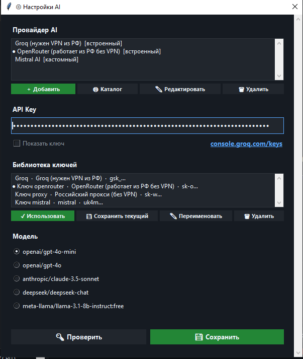

# 🎙️ XTTS Studio
> Портативное офлайн-приложение для клонирования голоса и синтеза речи на базе XTTS v2

---

## 🚀 О проекте

XTTS Studio — полностью офлайн инструмент для синтеза речи и клонирования голоса.  
Работает в портативном режиме, не требует установки и не использует интернет.  
AI-модуль опционален — подключается через любой OpenAI-совместимый провайдер.

---

> ⚠️ Google Drive может показать предупреждение о большом размере файла перед скачиванием — это нормально, файл не проверяется антивирусом Google из-за размера, а не из-за угрозы.

- ⚙️ CPU-only версия 5 ГБ 👉 [📥 Download XTTS Studio (Google Drive)](https://drive.google.com/file/d/1quGS9C4CXU4o0tmcGtK_ZQ8Pflb_xCHA/view?usp=drive_link)
- ⚙️ С поддержкой видеокарты N-Vidia CUDA 10 ГБ 👉 [📥 Download XTTS Studio (CUDA)](https://github.com/DreamSketcher/XTTS-Studio-portable-/releases/tag/XTTS_Studio_CUDA)

---

📜 Лицензия: [LICENSE.md](./LICENSE.md) — свободное использование с обязательным указанием автора

---

## 🧩 Разработка

Использовались AI-инструменты: Claude, ChatGPT

---

## ⚖️ Сторонние компоненты

Проект использует модель **XTTS v2** (Coqui), распространяемую под лицензией [Coqui Public Model License (CPML)](https://coqui.ai/cpml). Использование модели регулируется условиями CPML независимо от лицензии данного проекта.

---

## ✨ Возможности

### 🎤 Синтез и клонирование
- Полностью офлайн — никаких внешних запросов
- Portable — одна папка, любой Windows ПК
- Клонирование голоса по референсу 10–20 секунд
- Библиотека голосов с кэшем Speaker Embedding
- Поддержка длинных текстов без ограничений
- Авто-переключение языка RU/EN внутри одного текста

### 🧠 Обработка текста
- Числа → слова автоматически
- Аббревиатуры → фонетический словарь (авто + ручной)
- Смысловые и пунктуационные паузы — автоматически
- Нормализация текста перед генерацией

### 🎛 Управление качеством
- 4 пресета: ⭐ Высокое качество / 📖 Нарратив / ⚡ Динамика / 🎭 Экспрессия
- Тонкая настройка: temperature, top_p, repetition_penalty, скорость, trim
- Контроль качества чанков — авто-перегенерация при повторах и обрывах
- Де-эссер, RMS-нормализация громкости, авто-обрезка тишины
- Кэш чанков — повторная генерация того же текста не тратит время

### 🤖 AI-модуль (опционально)
- **AI Conductor** — анализирует текст и назначает параметры XTTS для каждого чанка индивидуально
  - Уровень 1: temperature, speed, паузы по контексту и интонации
  - Уровень 2: rewrite текста под заданный жанр или настроение (с negative prompt)
  - Оба уровня работают независимо и комбинируются
- **AI чат** — встроенный чат-ассистент с историей сессий и поиском
  - Режим редактора текста и режим свободного чата
  - Кнопка "Улучшить" — технический rewrite текста для лучшего TTS
- Поддержка цепочки провайдеров: Groq, OpenRouter, кастомные OpenAI-совместимые
- Каталог провайдеров, библиотека ключей

### 📋 Прочее
- Очередь задач с отменой
- Пакетная обработка TXT-файлов
- История генераций с возвратом текста
- Подсветка текущего чанка в реальном времени
- Статистика: время, чанки, голос, скорость
- Автосохранение настроек между сессиями
- Экспорт в WAV и MP3


## 🖼 Скриншоты

<p align="center">
  
  
</p>
<p align="center">
  
  
</p>

## 🚀 Быстрый старт

1. Скачайте и распакуйте архив
2. Не используйте путь с кириллицей
3. Запустите `XTTS Studio.exe`
4. Выберите или загрузите голосовой референс
5. Введите текст
6. Нажмите Generate
7. Результат сохраняется в `outputs/`

---

## ⚙️ Как работает

1. Загрузка голосового референса → авто-обработка и нормализация
2. (Опционально) сохранение в библиотеку голосов
3. Ввод текста → нормализация, числа в слова, аббревиатуры
4. (Опционально) AI-улучшение или rewrite текста
5. Разбивка на чанки → простановка пауз
6. (Опционально) AI Conductor — параметры для каждого чанка
7. Генерация с контролем качества и кэшированием
8. Сборка, нормализация громкости, де-эссер → финальный файл

---

## 📁 Структура проекта

```
engine/          — ядро: TTS пайплайн, AI модуль, обработка текста
gui.py           — графический интерфейс
settings.json    — настройки пользователя
gpt_settings.json — настройки AI провайдеров и ключей
word_rules.json  — словарь произношений
ffmpeg/          — встроенный FFmpeg
library/         — библиотека голосов
reference/       — входные аудио референсы
outputs/         — результаты генерации
logs/            — логи работы
models/          — модель XTTS v2 (офлайн)
python/          — portable Python runtime
XTTS Studio.exe  — точка входа
```

---

## 🧠 Словарь произношений

Примеры встроенных правил:
```
AI      → эй ай
CPU     → си-пи-ю
GPU     → джи-пи-ю
OpenAI  → ОпенЭйАй
```

Словарь пополняется автоматически при генерации и через AI Conductor.

---

## 💻 Требования

- Windows 10/11 x64
- CPU версия: 8+ ГБ RAM, генерация медленнее в реальном времени
- CUDA версия: NVIDIA GPU с 4+ ГБ VRAM, CUDA Compute Capability 6.0+

---

## ⚠️ Важно

Не используйте пути с кириллицей:
```
✔ C:\XTTS\
✘ C:\Новая папка\XTTS\
```

---

## ☕ Поддержка проекта

BTC: `bc1qz78u3lvagt3v886359glv57ct6rnlh506wjmdy`

---

