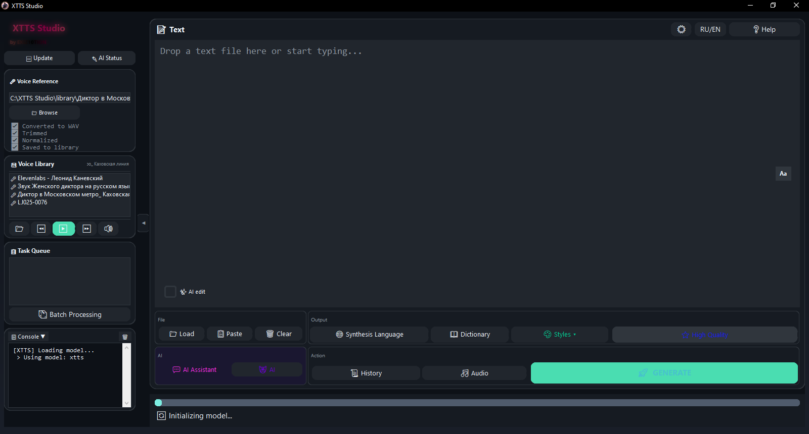
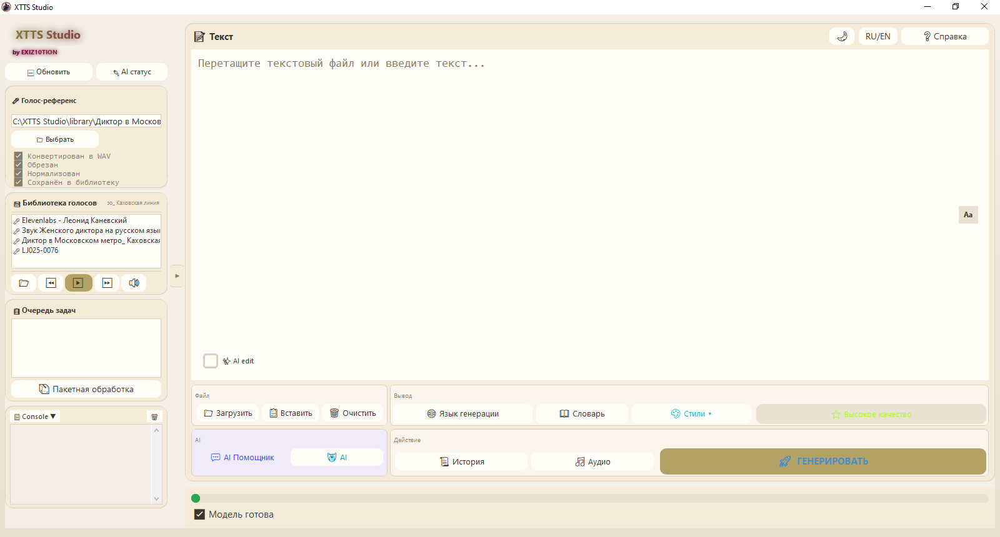
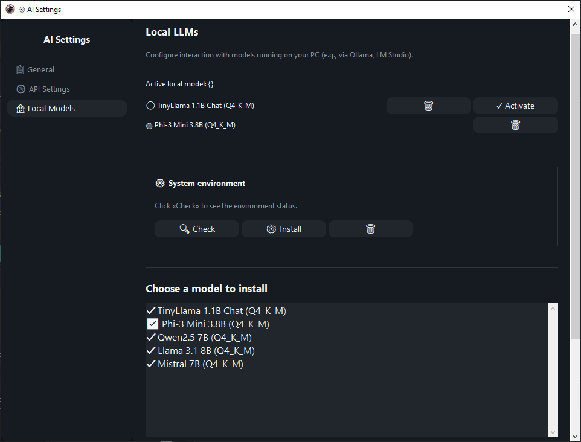
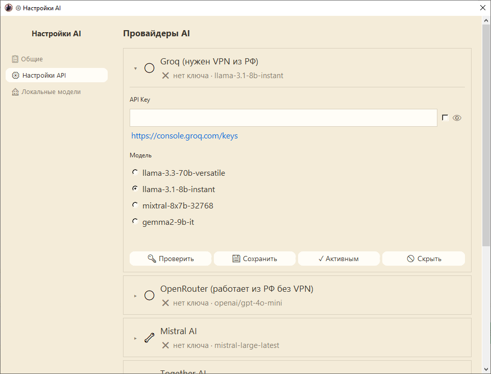
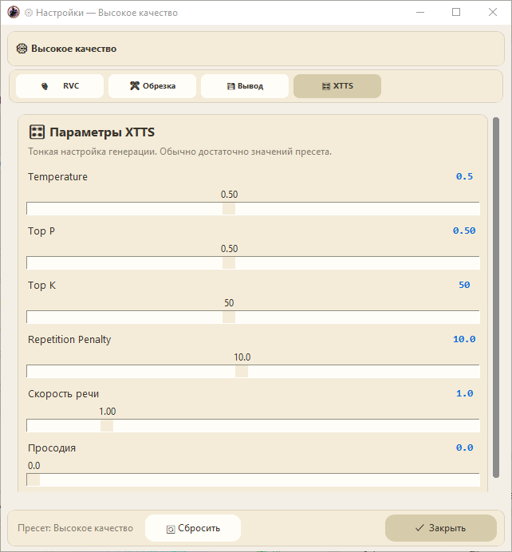

<div align="center">

**[English](./README.md)** · **[Русский](./README.ru.md)**

# 🎙️ XTTS Studio

### Клонируй любой голос. Озвучивай любой текст. Без интернета.

**Портативный офлайн voice cloning и text-to-speech для Windows — на базе XTTS v2**

<br/>

[](https://github.com/DreamSketcher/XTTS-Studio/releases)
[](https://github.com/DreamSketcher/XTTS-Studio)
[](https://github.com/DreamSketcher/XTTS-Studio/releases/tag/v1)
[](https://github.com/DreamSketcher/XTTS-Studio)
[](https://github.com/DreamSketcher/XTTS-Studio)
[](https://github.com/DreamSketcher/XTTS-Studio)

<br/>

**[📥 Скачать](https://github.com/DreamSketcher/XTTS-Studio/releases/tag/v1)** · **[🎧 Послушать](#-послушать)** · **[📖 Документация RU](./DOCUMENTATION.RU.md)** · **[📖 Документация EN](./DOCUMENTATION.EN.md)** · **[📜 Лицензия](./LICENSE.md)**

</div>

---

## Почему XTTS Studio

Большинство голосовых сервисов хотят ваши данные, подписку и постоянный интернет.

**XTTS Studio — иначе:**

| Параметр                 | Облачный TTS       | XTTS Studio                     |
|--------------------------|--------------------|---------------------------------|
| Нужен интернет           | Всегда             | **Никогда** (AI — опционально)  |
| Установка                | Аккаунты + драйверы| **Распаковал — запустил**       |
| Голос и текст уходят     | Да                 | **Нет**                         |
| Длинные тексты           | Часто лимиты       | **Без лимита**                  |
| GPU                      | Часто только платно| **CPU бесплатно · CUDA по запросу** |

Одна папка. Один двойной клик. Ваш компьютер — ваши правила.

---

## Послушать

> Здесь будут реальные демо — они работают лучше любой таблицы фич.

```text
[ media/demo-before-after.mp3 ]     ← placeholder
[ media/demo-rvc-enhance.mp3 ]      ← placeholder
[ media/demo-long-form.mp3 ]        ← placeholder
```

---

## Возможности

### 🎤 Голос, который звучит *как человек*

- Клонирование с референса **10–20 секунд**
- Библиотека голосов с кэшированием эмбеддингов
- **RVC-постобработка** — второй этап на каждый чанк (index, pitch, f0)
- Встроенный выбор RVC-моделей (локальные + офлайн-каталог + поиск на Hugging Face)
- Установка RVC-стека в один клик
- Поддержка длинных форм: книги, сценарии, реклама, закадр

### 🧠 Текст, который читается естественно

- Числа → слова, аббревиатуры → словарь
- **Ёфикация**, умные паузы, чистая просодия
- Защита инициалов: «А. С. Пушкин»

### 🎛 Качество под контролем

- **4 пресета:** Высокое качество · Нарратив · Динамика · Экспрессия
- Закреплённые вкладки настроек (RVC · Обрезка · Вывод · XTTS)
- Тонкая настройка сохраняется между сессиями
- QC чанков с авто-перегенерацией
- Экспорт **WAV** и **MP3**

### 🤖 AI — когда нужно; офлайн — когда не нужно

- Опциональный **AI Conductor** — температура/скорость/паузы по чанкам + переписывание стиля
- Встроенный **AI-чат** с цепочкой провайдеров
- **Локальные GGUF LLM** (llama-cpp) с безопасным fallback

### 🖥 Десктоп, а не «страница в браузере»

- Тёмная / светлая тема + конструктор тем
- Интерфейс **RU / EN**
- Портативная раскладка, неон, адаптивный toolbar
- Безопасные авто-обновления: **SHA256** + откат

---

## Скриншоты

<p align="center">
  
  
</p>

<p align="center">
  
  
</p>

<p align="center">
  
  
</p>

---

## Скачать

> ⚠️ Google Drive может показать *«файл слишком большой для проверки»* — это нормально для portable-сборки.

**[📥 Скачать XTTS Studio](https://github.com/DreamSketcher/XTTS-Studio/releases/tag/v1)**

- Сразу после распаковки работает на **CPU**
- Есть **NVIDIA GPU**? Включите CUDA в **⚙ Настройки → Ускорение**
- **Лицензия:** [LICENSE.md](./LICENSE.md) — бесплатно, с указанием автора

---

## Старт за 60 секунд

1. Распакуйте архив (**без кириллицы в пути**)
2. Запустите `XTTS Studio.exe`
3. Выберите референс **10–20 секунд**
4. Вставьте текст → **🚀 ГЕНЕРИРОВАТЬ**
5. Аудио — в папке `outputs/`

```text
✔  C:\XTTS\
✘  C:\Новая папка\XTTS\
```

---

## Кому подойдёт

- **Креаторы** — YouTube, реклама, подкасты, character VO
- **Авторы и студии** — аудиокниги, длинный закадр
- **Команды с приватностью** — тексты, которые не должны уходить в облако
- **Продвинутые пользователи** — пресеты, RVC, локальный AI, конструктор тем

---

## Требования

|                  | CPU (по умолчанию)  | CUDA (опционально)            |
|------------------|---------------------|-------------------------------|
| **ОС**           | Windows 10/11 x64   | Windows 10/11 x64             |
| **RAM**          | 8+ ГБ               | 8+ ГБ                         |
| **GPU**          | —                   | NVIDIA, 4+ ГБ VRAM, CC 6.0+   |
| **Скорость**     | медленнее real-time | часто быстрее real-time       |

---

## Документация

Эта страница — **продуктовый pitch**.

| Язык    | Полная документация             | Справочник функций                     |
|---------|---------------------------------|----------------------------------------|
| English | [DOCUMENTATION.EN.md](./DOCUMENTATION.EN.md) | [unified_function_reference.EN.md](./unified_function_reference.EN.md) |
| Русский | [DOCUMENTATION.RU.md](./DOCUMENTATION.RU.md) | [unified_function_reference.RU.md](./unified_function_reference.RU.md) |

---

## Поддержать проект

Если XTTS Studio экономит вам время или деньги:

**BTC:** `bc1qz78u3lvagt3v886359glv57ct6rnlh506wjmdy`

---

## Сторонние компоненты

Используется **XTTS v2** (Coqui) по [Coqui Public Model License (CPML)](https://coqui.ai/cpml).

---

<div align="center">

**XTTS Studio** · by EXIZ10TION · Made with ❤️

[Скачать](https://github.com/DreamSketcher/XTTS-Studio/releases/tag/v1) · [Docs RU](./DOCUMENTATION.RU.md) · [Docs EN](./DOCUMENTATION.EN.md) · [Лицензия](./LICENSE.md)

</div>
